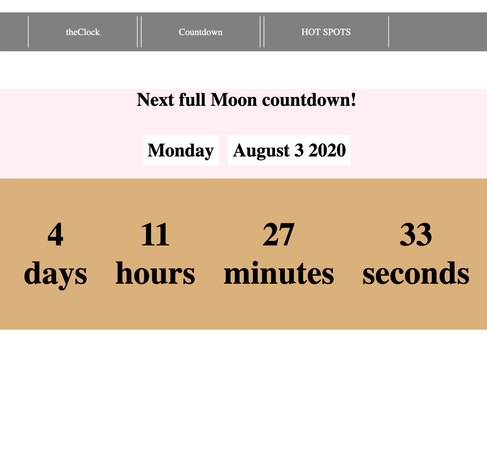
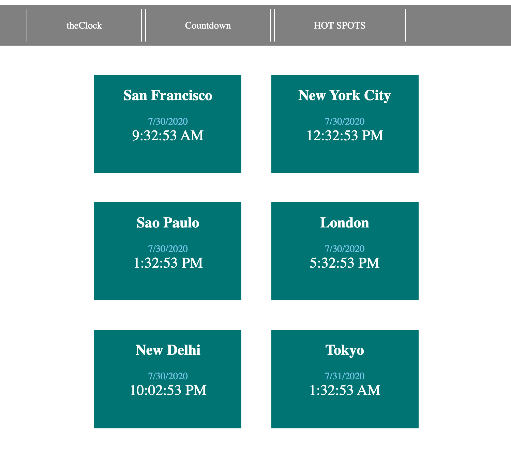

# theClock App

theClock App is an App that displays the current time as well as other features. All written in html, css, vanilla JS.

Live Link: https://theclockapp.netlify.app/

<h2>Summary</h2>
One of my short term goals was to build something to call mine. This Clock App is exactly just that. In a short time, I was able to build this app using what I learned through reading and practicing code. I am proud to have achieved it and I cannot wait to build the next app.

<h2>Author</h2>

Roger Alexander - Full Stack Developer
